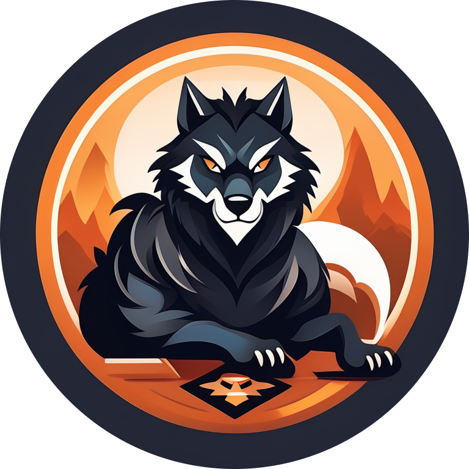

<div align="center">


# Werewolf Game · 会学习的狼人杀智能体

多智能体狼人杀系统，基于 AgentScope，可进行自我博弈、复盘分析与策略迭代。

</div>

## 特性亮点

- 规则完备：支持 6/9/12 人板型、昼夜循环、投票/夜间行动与胜负判定
- 多模型适配：DashScope(Qwen)/OpenAI/DeepSeek/ModelScope/Ollama 本地模型
- 自我对弈：批量开局、可中断恢复、策略与复盘自动持久化
- 易于扩展：清晰的编排器与 Agent 接口，便于添加新角色/策略

> 更多展示请查看 [doc/index.md](./index.pdf)

## 环境配置

```powershell
# 1) 可选：创建并激活虚拟环境
python -m venv env
.\env\Scripts\Activate.ps1

# 2) 安装项目（包含依赖）
pip install -e .

# 3) 可选：安装测试依赖
pip install -e ".[test]"
```

### 配置模型（任选其一）

项目通过环境变量读取各家 API Key，亦支持在仓库根目录创建 `.env.local`（参考 `werewolf/config.py`）。

```powershell
# PowerShell 设置环境变量（会话内生效）
$env:OPENAI_API_KEY = "sk-..."
$env:DASHSCOPE_API_KEY = "..."
$env:DEEPSEEK_API_KEY = "..."
$env:MODELSCOPE_API_KEY = "..."
```

默认会按以下优先级自动选择可用模型：ModelScope → DeepSeek → OpenAI → DashScope → Ollama（本地无需 Key，但需本机服务可用）。也可在运行时用参数 `--model`/`-m` 指定。

## 快速体验

### 单局对战（多智能体 + AgentScope）

```powershell
python run_game.py --game-type six --rounds 10 --discuss 2 --verbose
```

常用参数：

- `--game-type {six|nine|twelve}` 对局人数/板型
- `--model <config_name>` 使用的模型配置名（见 `werewolf/config.py` 中 `MODEL_CONFIGS`）
- `--rounds <int>` 最多昼夜轮数，默认 20
- `--discuss <int>` 每个白天的讨论轮次，默认 3
- `--players "Alice,Bob,..."` 自定义玩家名（覆盖预设）

> 运行后会打印对局摘要，并将完整日志保存到文件（由编排器维护）。

### 自我对弈训练（策略迭代）

批量运行游戏，自动复盘分析并迭代更新策略提示词：

```powershell
# 运行 50 局（默认）
python run_selfplay.py

# 常用：大规模并行九人局 + 指定模型
python run_selfplay.py -n 1200 -p 8 -m deepseek_chat -t nine

# 其它参数
python run_selfplay.py -n 100      # 自定义局数
python run_selfplay.py -p 4        # 并行工作进程（1-8）
python run_selfplay.py -t twelve   # 12 人局
python run_selfplay.py --no-resume # 从头开始（忽略历史进度）
python run_selfplay.py -v          # 详细过程打印
```

训练过程会自动创建并维护以下目录：

- `.training/strategies/` 角色策略提示词（迭代更新）
- `.training/game_logs/` 对局日志
- `.training/reviews/` 复盘分析结果
- `.training/progress/progress.json` 训练进度元数据

> 支持中断恢复、策略版本备份与统计输出（胜率、平均回合数等）。

## 模型与配置

在 `werewolf/config.py` 中可查看/修改：

- `MODEL_CONFIGS`：各模型的 `config_name / model_type / model_name / base_url / api_key`
- `DEFAULT_MODEL`：默认模型（当未检测到可用 Key 时回退）
- `GAME_CONFIG`：默认 `game_type / max_rounds / discussion_rounds / verbose`
- 预设玩家名：`PLAYER_NAMES_6/9/12`

## 常见问题（FAQ）

- 提示未找到可用模型：请设置环境变量或在 `.env.local` 中写入对应 `*_API_KEY`
- Ollama 本地模型无法连接：确认本机 11434 端口服务可用
- 运行缓慢/费用较高：将 `--discuss`/`--rounds` 调小，或改用轻量模型（如 Qwen Turbo、GPT-4o-mini）
- Windows 权限问题：PowerShell 如禁用脚本执行，可在管理员窗口执行 `Set-ExecutionPolicy RemoteSigned`

## 版权与鸣谢

- 基于 [AgentScope](https://github.com/modelscope/agentscope) 构建
- 本仓库仅用于研究与学习，请在遵守各 API/模型服务条款的前提下使用
