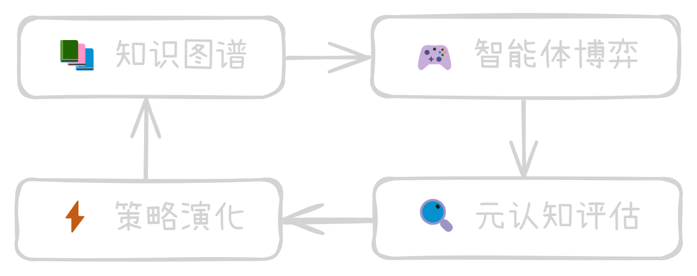

# **基于 AgentScope 的狼人杀智能体**

### 构建具备复盘与迭代能力的自我进化多智能体系统

 

---

## 1. a

## 2. a

## 3.

---

## _asdf_

**asdfaaaaaaaaaaaaaaaaaaaaaaaaaaaaaaaaaaaa**

asdfaaaaaaaaaaaaaaaaaaaaaaaaaaaaaaaaaaaa

asdfaaaaaaaaaaaaaaaaaaaaaaaaaaaaaaaaaaaa

asdfaaaaaaaaaaaaaaaaaaaaaaaaaaaaaaaaaaaa

asdfaaaaaaaaaaaaaaaaaaaaaaaaaaaaaaaaaaaa

asdfaaaaaaaaaaaaaaaaaaaaaaaaaaaaaaaaaaaa

asdfaaaaaaaaaaaaaaaaaaaaaaaaaaaaaaaaaaaa

asdfaaaaaaaaaaaaaaaaaaaaaaaaaaaaaaaaaaaa

---

