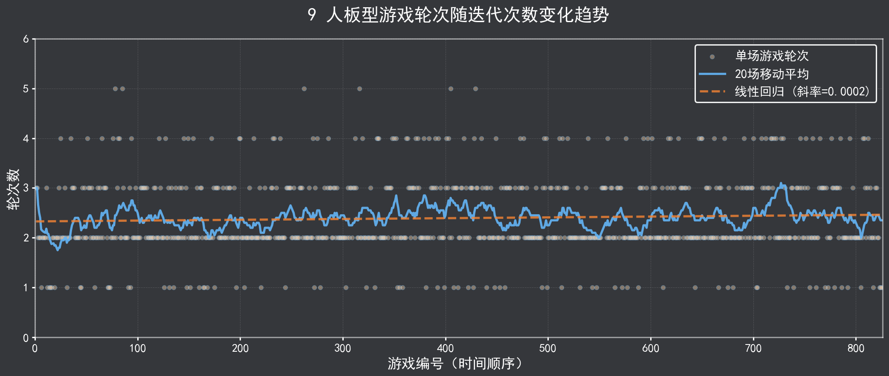
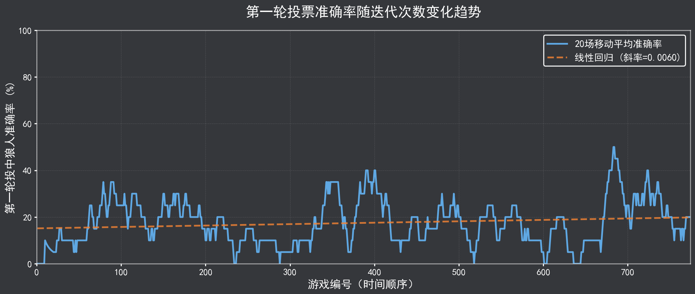
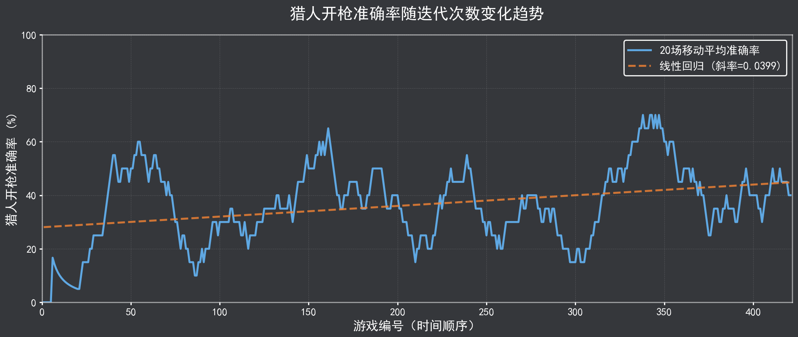

<style>
:root {
  --primary: rgb(245, 132, 52);
  --secondary: rgb(251, 162, 81);
  --accent: rgb(253, 216, 179);
  --background: rgb(53, 55, 59);
}

header {
    position: absolute;
    left: auto !important;
    right: 30px !important;
    color: var(--secondary);
    font-weight: bold;
}

footer {
    color: var(--secondary);
    /* font-weight: bold; */
}

section[id="1"] header {
    display: none !important;
}

strong {
  color: var(--primary);
}

b {
  color: var(--secondary);
}

a {
  color: var(--secondary);
}

.center{
  display: flex;
  justify-content: center;
  align-items: center;
  height: 100%;
}
</style>


# **会学习的狼人杀智能体**

### 基于 AgentScope 构建自我进化的多智能体系统

---


## **1. 项目愿景**

## 2. 系统设计

## 3. 演示方案

## 4. 未来展望

---

## 🎯 狼人杀游戏

#### 🃏 不完全信息博弈

- 玩家仅拥有 **部分信息**
- 需要通过推理、欺骗和沟通获取真相

#### 🤝 混合合作与竞争

- 阵营内部需要合作，阵营之间需要对抗
- 如何 **识别阵营成员，正确站边**

#### 🧠 高阶认知能力

- 考验智能体 **语言理解** 和 **逻辑推理** 能力
- 同时拥有心理揣测、策略规划能力

---

## 💡 我们的核心愿景

#### 让 AI 智能体能够像人类一样，通过 "复盘" 和 "练习" **不断提升游戏水平**

##

### ✅ 基础目标

- 实现稳定运行的狼人杀游戏环境
- 部署具有基础游戏能力的多角色智能体

### 🚀 核心创新目标

- **复盘分析**：自动分析关键决策点的得失
- **策略更新**：基于复盘优化决策模型
- **能力提高**：通过自我对弈提升胜率

---


## 1. 项目愿景

## **2. 系统设计**

## 3. 演示方案

## 4. 未来展望

---

## 🔄 迭代学习工作流

<br><br><br><br><br><br><br><br><br>


核心循环：自我博弈 → 数据记录 → 复盘分析 → 策略更新 → 新一轮博弈

---

## ⚙️ 核心模块详解

### 🏛️ 游戏环境（法官）

- 负责维护全局游戏状态与规则执行
- 支持 6 人 / 9 人 / 12 人 等多种对局规模
- 驱动游戏回合推进与胜负判定

### 🤖 玩家智能体系统

- 基于 **AgentScope 框架** 构建的多角色体系
- 具备身份认知与阵营归属意识
- 自主发言生成与策略决策
- 支持 **私有记忆存储** 与 **动态策略注入**

---

## 💾 经验记忆体系

### 🗣️ 对话记忆库

- 完整记录游戏过程中的所有对话交互
- 为智能体提供上下文理解与行为连贯性支撑

### 📊 结构化对局日志

- 系统化存储每局游戏的完整轨迹数据
- 涵盖行动序列、投票记录、胜负归因
- 构建迭代学习闭环的 **数据燃料** 🔥

---

## 🧠 学习引擎：核心技术 ⭐

### 🔍 智能复盘分析

- 对局结束后自动触发深度分析
- 精准定位关键决策节点与胜负手
- 生成个性化玩家表现评估报告

### 🚀 动态策略优化

- 实时提示词工程优化（已实现）
- 模型微调与强化学习进阶（规划中）

<!-- ---

## 📝 提示词迭代优化示例

游戏前：**基础策略**

```
作为预言家，验证可疑玩家的身份
```

复盘分析

```
预言家 Alice 未能及时跳明身份带队，导致村民阵营失利
建议：预言家应在首次验证到好人后立即公开身份
```

游戏后：**优化策略**

```
作为预言家，首次验到好人后可以立即跳明身份，建立信任圈
```

---

## 📝 提示词迭代优化示例

游戏前：**基础策略**

```
作为狼人，隐藏身份，避免被投票出局
```

复盘分析

```
狼人 Bob 全程跟随好人投票，缺乏主动性，未能有效扰乱局势
建议：狼人可以尝试倒钩战术，主动站边真预言家获取信任
```

游戏后：**优化策略**

```
作为狼人，前期可以实行倒钩战术，后期抗推真预言家及其团队。
``` -->

---

## 🔧 技术实现亮点

### 可恢复训练

```bash
python run_selfplay.py -n 10 -p 4 -m modelscope_chat/deepseek_chat
```

- 自动保存进度，支持中断续训
- 策略版本管理和回溯

### 实时监控

- 训练过程实时可视化
- 异常检测和自动处理

---


## 1. 项目愿景

## 2. 系统设计

## **3. 演示方案**

## 4. 未来展望

---

## 📊 成长对比实验

进行了超 **800 局 9 人** + **100 局 12 人** 板型的混合对局



---

## 📊 成长对比实验

第一轮投中狼人概率从 17.12% 提升至 19.07%，基础推理能力缓慢提升



---

## 📊 成长对比实验

女巫毒药准确率从 52.00% 跃升至 68.00%，毒中狼人概率显著提高


---

## 📊 成长对比实验

猎人开枪准确率从 31.43% 提升至 41.43%，带走狼人能力明显进步



---

## 🎬 现场对战演示

- [🔫 对战演示链接](https://zhangzrjerry.github.io/werewolf/)

## 🎯 智能体学习链

- 🧙‍♀️ [女巫学习链](https://zhangzrjerry.github.io/werewolf/witch)
- 🕵️‍♂️ [预言家学习链](https://zhangzrjerry.github.io/werewolf/seer)
- 🐺 [狼人学习链](https://zhangzrjerry.github.io/werewolf/werewolf)
- 👨‍🌾 [村民学习链](https://zhangzrjerry.github.io/werewolf/villager)

---


## 1. 项目愿景

## 2. 系统设计

## 3. 演示方案

## **4. 未来展望**

---

## 🔮 未来展望

#### 👥 更多机制玩法

- 开发对战界面，支持 **人类玩家** 加入
- 增加 “_机械狼通灵师_”、“_假面舞会_” 更多板型
- 增加 **警徽流** 等复杂机制

#### 🎯 更先进的算法

- 多智能体强化学习应对更复杂的机制

#### 📚 更多数据来源

- 结合 **京城大师赛** 等人类玩家数据，混合学习

---

## 📌 项目亮点

我们打造了一个具备动态进化能力的狼人杀 AI 系统，突破传统规则型 AI 局限：

- 🔧 **技术融合**：结合 AgentScope 框架、LLM 认知与强化学习，构建完整学习闭环
- 📈 **策略进化**：通过自我对弈和智能复盘，实现从规则驱动到经验驱动的跨越
- 🤝 **社交模拟**：在合作与对抗中展现复杂交互行为

充分展示了 **AgentScope 框架** 在构建进化式多智能体系统方面的强大潜力。

---


# **Thank You!**

### 🔗 项目地址

https://github.com/zhangzrjerry/werewolf

### 📧 联系我们

zhangzrjerry@outlook.com

### 🔮 魔搭社区

正在搭建创空间应用以便体验
