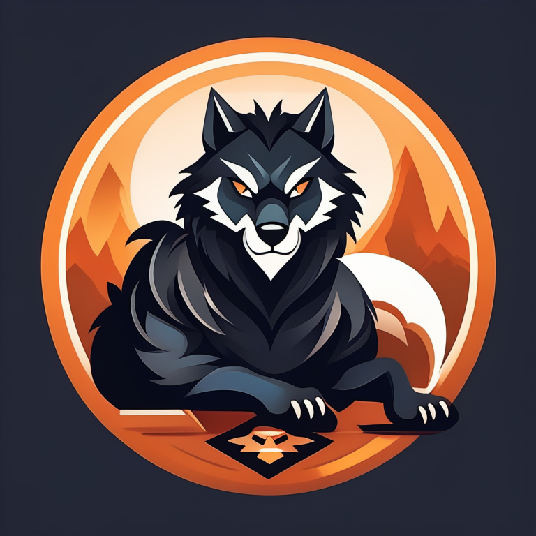
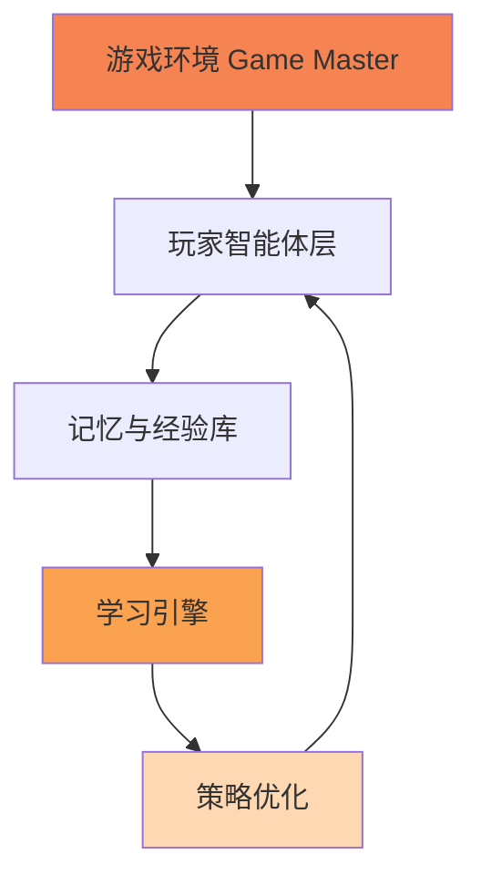
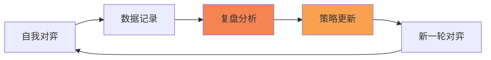

<style>
:root {
  --primary: rgb(245, 132, 52);
  --secondary: rgb(251, 162, 81);
  --accent: rgb(253, 216, 179);
  --background: rgb(35, 39, 54);
}

header {
    position: absolute;
    left: auto !important;
    right: 30px !important;
}

section[id="1"] header,
section[id="2"] header {
    display: none !important;
}

strong {
  color: var(--primary);
}

b {
  color: var(--secondary);
}

a {
  color: var(--secondary);
}

.mermaid {
    display: flex !important;
    justify-content: center !important;
    margin: 0 auto !important;
}
</style>



# **会学习的狼人杀智能体**

### 基于 AgentScope 构建自我进化的多智能体系统

---


# **项目背景**

## 狼人杀：AI 的终极挑战

---

## 🎯 狼人杀游戏的独特挑战

<br>

**🃏 不完全信息博弈**
玩家仅拥有部分信息，需要通过推理、欺骗和沟通获取真相

**🤝 混合合作与竞争**
阵营内部需要合作，阵营之间则是对抗关系

**🧠 高阶认知能力**
语言理解与生成、逻辑推理、心理揣测、策略规划

**⚡ 动态交互环境**
策略随游戏进程和其他玩家行为实时改变

---

## 😞 现有 AI 方案的局限

<br>

| 问题                | 表现                                       |
| ------------------- | ------------------------------------------ |
| **规则固化/脚本化** | 基于固定规则或决策树，策略单一易被识破     |
| **缺乏真正成长性**  | 无法从对局中总结经验，水平上限在开发时设定 |
| **交互生硬**        | 智能体间对话缺乏"人味"，难以模拟真实玩家   |
| **无法迭代学习**    | 不能像人类一样通过复盘和练习提升水平       |

---

## 💡 我们的机遇

<br>

**AgentScope 框架**
提供便捷的多智能体编排、对话管理和角色扮演能力

**大语言模型突破**
在语言、推理和知识方面提供强大的基础能力

**强化学习潜力**
通过环境交互和奖励反馈，实现真正的"迭代学习"

---

<!-- _class: lead -->

# **项目愿景**

## 从"会玩"到"会学"

---

## 🎯 核心愿景

<br>

> 构建一个**不仅会玩，而且会学**的狼人杀智能体生态系统
>
> 让 AI 智能体能够像人类一样，通过"复盘"和"练习"
>
> **不断提升游戏水平**

---

## 📋 项目目标

<br>

**✅ 基础目标**
实现可稳定运行、规则完备的狼人杀游戏环境
部署具有基础游戏能力的多角色智能体

**🚀 核心创新目标（迭代学习）**

- **复盘分析**：自动分析关键决策点的得失
- **策略更新**：基于复盘优化决策模型和提示词
- **水平进化**：通过自我对弈提升胜率和欺骗/识谎能力

**🎨 高阶展示目标**
可视化思考过程、策略演变和历史胜率曲线

---

<!-- _class: lead -->

# **系统设计**

## 技术架构与创新方案

---

## 🏗️ 整体架构



**核心循环**：自我对弈 → 数据记录 → 复盘分析 → 策略更新 → 新一轮对弈

---

## 🎮 核心模块（1/4）：游戏环境

<br>

**Game Master（裁判）**

- 基于 AgentScope 的 Agent 类构建
- 维护游戏状态、执行规则、推动回合
- 判定胜负，作为所有玩家的"上帝"

**游戏支持**

- 6 人局、9 人局、12 人局
- 完整角色体系：狼人、预言家、女巫、守卫、猎人、平民

---

## 🤖 核心模块（2/4）：玩家智能体

<br>

**身份认知**
清楚自己的阵营（狼人/神民/平民）和技能

**核心大脑（基于 LLM）**

- **发言生成**：根据局势和身份生成有说服力/欺骗性的文本
- **行动决策**：夜晚行动（刀人、验人等）和白天投票
- **私有记忆**：存储只有自己知道的信息

**策略注入**
支持动态加载策略提示词，指导智能体决策

---

## 💾 核心模块（3/4）：记忆与经验库

<br>

**对话记忆**
存储完整的游戏对话历史，用于上下文理解

**对局日志**
结构化存储整局游戏的完整轨迹：

- 每个玩家的行动、发言
- 投票记录、夜晚行动
- 最终的胜负结果

> 这是实现迭代学习的**"数据燃料"** 🔥

---

## 🧠 核心模块（4/4）：学习引擎 ⭐

<br>

**复盘分析模块**

- 游戏结束后自动启动"复盘 Agent"
- 阅读整局日志，分析关键节点
- 输出每个玩家的**复盘报告**（决策优劣分析+改进建议）

**策略优化模块**

- **方法一**：提示词工程优化（当前实现）
- **方法二**：模型微调（SFT）- 进阶方案
- **方法三**：强化学习（PPO）- 未来展望

---

## 🔄 迭代学习工作流



<br>

1. **N 个智能体进行完整游戏**
2. **将交互和结果存入记忆库**
3. **学习引擎分析对局，生成复盘报告**
4. **根据报告更新智能体策略**
5. **更新后的智能体再次游戏，检验学习效果**

---

## 📝 提示词迭代优化示例

<br>

**游戏前：基础策略**

```
作为预言家，验证可疑玩家的身份
```

**复盘分析**

```
预言家 Alice 未能及时跳明身份带队，导致村民阵营失利
建议：预言家应在首次验证到好人后立即公开身份
```

**游戏后：优化策略**

```
作为预言家，首次验到好人后应立即跳明身份，建立信任圈
```

---

<!-- _class: lead -->

# **核心创新**

## 技术突破与优势

---

## 🌟 创新点

<br>

**1️⃣ 从"静态"到"动态进化"**
突破传统规则型 AI 的天花板，实现策略的持续迭代和自主进化

**2️⃣ 技术融合创新**
AgentScope 多智能体框架 + LLM 认知能力 + 强化学习
构建完整的"学习-应用-提升"闭环

**3️⃣ 应用场景拓展性**
不仅是游戏 AI，更是多智能体协作与对抗研究的模拟环境
可用于研究谈判、传播学、心理学等多个领域

---

## 📊 实际效果展示

<br>

**当前实现**

- ✅ 完整的 6/9/12 人局游戏环境
- ✅ 基于 LLM 的智能体决策系统
- ✅ 自动复盘与策略提取
- ✅ 提示词迭代优化机制
- ✅ 游戏日志与训练进度追踪

**学习效果**

- 策略规则自动生成与优化
- 角色特定的战术库积累
- 跨对局的经验传承

---

<!-- _class: lead -->

# **演示方案**

## 让"成长"变得可见

---

## 🎬 演示方案

<br>

**1. 现场对战**
展示智能体间的完整游戏，实时显示"内心独白"（推理链）

**2. 成长对比**
对比"初代"智能体和"经过 N 局训练后"智能体的决策差异

**3. 数据可视化**

- 胜率变化曲线
- 策略规则演化历史
- 关键决策点热力图

---

## 🗓️ 项目里程碑

<br>

| 阶段        | 内容                         | 状态      |
| ----------- | ---------------------------- | --------- |
| **Phase 1** | 基础游戏环境与规则型智能体   | ✅ 已完成 |
| **Phase 2** | 集成 LLM，实现语言和推理能力 | ✅ 已完成 |
| **Phase 3** | 经验回放与提示词迭代学习     | ✅ 已完成 |
| **Phase 4** | 模型微调和强化学习优化       | 🔄 规划中 |

---

<!-- _class: lead -->

# **技术细节**

## 代码结构与实现

---

## 📁 项目结构

```
werewolf/
├── werewolf/              # 核心代码
│   ├── agents.py          # 玩家智能体实现
│   ├── werewolf_game.py   # 游戏引擎
│   ├── orchestrator.py    # 游戏编排器
│   ├── learning_engine.py # 学习引擎 ⭐
│   └── config.py          # 模型配置
├── .training/             # 训练数据
│   ├── strategies/        # 策略库
│   ├── game_logs/         # 游戏日志
│   ├── reviews/           # 复盘报告
│   └── progress/          # 训练进度
├── run_game.py            # 单局游戏
└── run_selfplay.py        # 自我对弈训练 ⭐
```

---

## 🔧 关键技术实现

<br>

**智能体决策流程**

```python
# 基于 LLM + 策略规则的决策
class WerewolfAgent:
    def decide_vote(self, context):
        # 1. 加载角色策略
        strategy_rules = self.load_strategy()
        # 2. 构建提示词（含策略）
        prompt = self.build_prompt(context, strategy_rules)
        # 3. LLM 生成决策
        decision = self.llm(prompt)
        return decision
```

---

## 🧠 学习引擎核心

<br>

**复盘分析**

```python
class ReviewAgent:
    def analyze_transcript(self, transcript, roles, winner):
        # 分析完整对局，生成：
        # 1. 每个玩家的表现评价
        # 2. 整体胜负原因分析
        # 3. 按角色分类的策略建议
        return per_player_reviews, overall_summary, lessons
```

**策略优化**

```python
class StrategyManager:
    def save_rules_for_role(self, role, rules):
        # 持久化策略规则，供下局使用
        # 自动备份历史版本
```

---

## 🚀 自我对弈训练

<br>

**训练循环**

```bash
python run_selfplay.py -n 10 -p 4 -m deepseek_chat -t twelve

# -n: 对弈局数
# -p: 并行工作进程
# -m: LLM 模型
# -t: 游戏类型（six/nine/twelve）
```

**可恢复训练**

- 自动保存进度
- 支持中断后继续
- 策略版本管理

---

<!-- _class: lead -->

# **未来展望**

## 持续演进的方向

---

## 🔮 未来工作

<br>

**🎯 算法升级**

- 多智能体强化学习（MARL）
- 模型蒸馏与压缩
- 更复杂的对手建模

**👥 人机对战**

- 支持人类玩家加入
- 混合人机游戏模式
- 实时对战界面

**🌐 社区建设**

- 开源项目，吸引研究者参与
- 构建智能体策略市场
- 举办 AI 狼人杀竞赛

---

## 🎓 学术价值

<br>

**多智能体系统研究**
探索合作与对抗环境下的学习机制

**自然语言理解与生成**
在复杂社交场景中的应用

**可解释 AI**
可视化智能体的推理过程和决策依据

**迁移学习**
策略在不同场景（谈判、辩论）中的迁移能力

---

<!-- _class: lead -->

# **总结**

---

## 📌 项目总结

<br>

我们打造了一个**里程碑式的狼人杀 AI 项目**

它不仅是一个游戏程序，更是一个能够：

- 🧠 **自我学习**：从对局中总结经验
- 📈 **持续进化**：策略不断优化提升
- 🤝 **多智能体协作**：模拟复杂社交互动

充分展示了 **AgentScope 框架**在构建复杂交互应用方面的强大潜力

---


# **Thank You!**

### 🔗 项目地址

https://github.com/zhangzrjerry/werewolf

### 📧 联系我们

zhangzrjerry@github.com

<br>

**让 AI 像人类一样学习和成长** 🚀
